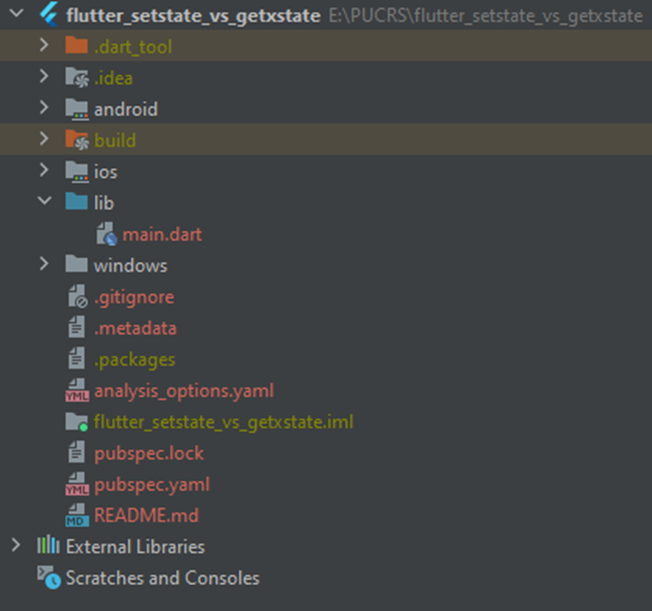
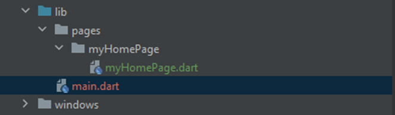

# Iniciando no Flutter com boas práticas!

Inicialmente, após toda a burocracia para a criação de um novo projeto Flutter, apague o código de todos os comentários introdutórios para limpar o projeto.<br/>
Para fins de boas práticas, o código será modularizado em blocos menores.

### flutter_setstate_vs_getxstate -> lib
<div style="width: 400px;">


</div>

Dentro da pasta lib, crie uma pasta chamada `pages`. Esta pasta será responsável por armazenar arquivos de código da tella (_frontend_) e também da lógica de negócio de cada tela do app.


### flutter_setstate_vs_getxstate -> lib -> pages -> myHomePage
<div style="width: 400px">


</div>

Note na imagem anterior como o projeto ficou estruturado.
O arquivo `myHomePage.dart` é uma parte do código que estava contido no arquivo `main.dart` criado no template inicial do Flutter.

## main.dart
```dart
void main() {
  runApp(const MyApp());
}

class MyApp extends StatelessWidget {
  const MyApp({Key? key}) : super(key: key);

  @override
  Widget build(BuildContext context) {
    return MaterialApp(
      title: 'Flutter Demo',
      theme: ThemeData(
        primarySwatch: Colors.blue,
      ),
      home: const MyHomePage(title: 'Flutter com setState()'),
    );
  }
}
```
## myHomePage.dart
```dart
import 'package:flutter/material.dart';

class MyHomePage extends StatefulWidget {
  const MyHomePage({Key? key, required this.title}) : super(key: key);

  final String title;

  @override
  State<MyHomePage> createState() => _MyHomePageState();
}

class _MyHomePageState extends State<MyHomePage> {
  int _counter = 0;

  void _incrementCounter() {
    setState(() {
      _counter++;
    });
  }

  @override
  Widget build(BuildContext context) {
    return Scaffold(
      appBar: AppBar(
        centerTitle: true,
        title: Text(widget.title),
      ),
      body: Center(
        child: Column(
          mainAxisAlignment: MainAxisAlignment.center,
          children: <Widget>[
            const Text(
              'You have pushed the button this many times:',
            ),
            Text(
              '$_counter',
              style: Theme.of(context).textTheme.headline4,
            ),
          ],
        ),
      ),
      floatingActionButton: FloatingActionButton(
        onPressed: _incrementCounter,
        tooltip: 'Increment',
        child: const Icon(Icons.add),
      ),
    );
  }
}
```

No código a seguir, repare que dentro da classe `_MyHomePageState` até a marcação `@override` tem a variável `_counter`, inicializada com o valor `0` e um método `_incrementCounter()`.<br/>
O método `_incrementCounter()` tem uma unica responsabilidade: Somar uma unidade na variável `_counter` sempre que invocado.

A tela do aplicativo só sera atualizada se a ação de _incrementar + 1_ estiver dentro de um método de setar estado, o famoso `setState()`.

```dart
class _MyHomePageState extends State<MyHomePage> {
  int _counter = 0;

  void _incrementCounter() {
    setState(() {
      _counter++;
    });
  }

  @override
  Widget build(BuildContext context) {
    ...
```

A maneira nativa de controlar os estados da tela do aplicativo que o Flutter proporciona, conforme o projeto cresce, fica muito difícil de programar e mais difícil ainda para dar manutenção no código.
Na proxima Branche esta maneira de setar o estado da tela (atualizar a tela) será feito com um gerenciador de estados excelente chamado `GetX`.

[Branche: flutter_com_getX_e_Obx](https://github.com/GuiWolff/flutter_setstate_vs_getxstate/tree/flutter_com_getX_e_Obx)