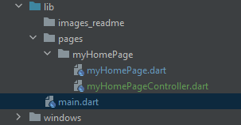

# Instalando o pacote GetX!

Dentro do arquivo pubspec.yaml, os comentários para o código ficar legível.
Repare como ficou no código abaixo.
### `flutter_setstate_vs_getxstate -> pubspec.yaml`
```yaml
name: flutter_setstate_vs_getxstate
description: setState Vs. Obx

publish_to: 'none'

version: 1.0.0+1

environment:
  sdk: ">=2.16.0-80.1.beta <3.0.0"

dependencies:
  flutter:
    sdk: flutter

  cupertino_icons: ^1.0.2

dev_dependencies:
  flutter_test:
    sdk: flutter

  flutter_lints: ^1.0.0

flutter:

  uses-material-design: true
```

Note que foi adicionada a linha contendo `get: ^4.6.1`.<br/>
O código deve estar identado exatamente como a linha que contem `cupertino_icons: ^1.0.2`
```yaml
dependencies:
  flutter:
    sdk: flutter

  cupertino_icons: ^1.0.2
  get: ^4.6.1
```
Após inserir o pacote desejado, clique em `pub get` como na imagem a seguir.

### `flutter_setstate_vs_getxstate -> lib`
<div style="width: 400px;">


</div>

Prontinho! o GetX está instalado! <br/>
Agora vamos por a mão na massa para inserir o getX no projeto!

### `main.dart`
```dart
void main() {
  runApp(const MyApp());
}

class MyApp extends StatelessWidget {
  const MyApp({Key? key}) : super(key: key);

  @override
  Widget build(BuildContext context) {
    return MaterialApp(
      title: 'Flutter Demo',
      theme: ThemeData(
        primarySwatch: Colors.blue,
      ),
      home: const MyHomePage(title: 'Flutter com setState()'),
    );
  }
}
```

Em `main.dart`, altere `MaterialApp` para `GetMaterialApp`
```dart
void main() {
  runApp(const MyApp());
}

class MyApp extends StatelessWidget {
  const MyApp({Key? key}) : super(key: key);

  @override
  Widget build(BuildContext context) {
    return GetMaterialApp(
      title: 'Flutter Demo',
      theme: ThemeData(
        primarySwatch: Colors.blue,
      ),
      home: const MyHomePage(title: 'Flutter com setState()'),
    );
  }
}
```
Pronto! Agora o `GetX` está instalado no projeto!

## Alterando o genciador de estados na page `MyHomePage`

Em `myHomePage.dart` delete a classe `MyHomePage extends StatefulWidget` inteira.<br/>
Na classe seguinte `_MyHomePageState extends State<MyHomePage>`, altere o código `_MyHomePageState extends State<MyHomePage>` para `MyHomePage extends GetView`. Repare que aparecerá alguns erros, mas isto não é problema, pois já iremos concertar!

Para concertar o primeiro erro, a classe `MyHomePage` deve ter seu construtor recebendo o título da page, definido na classe `MyApp`, no arquivo `main.dart`.

```dart
class MyHomePage extends GetView {
  MyHomePage(this. title);
  String title;
  ...
  ```
Após criar o construtor, irá aparecer um _warning_ nele, então posicione o mouse encima do _warning_ até aparecer uma lampada amarela de sugestões e clique na sugestão Add 'key' to constructor, como na imagem abaixo.

<div style="width: 400px;">


</div>

O proximo erro se resolve removento o método `setState()` de dentro do método `_incrementCounter()`, veja os códigos a seguir:
### Antes
```dart
  void _incrementCounter() {
    setState(() {
      _counter++;
    });
  }
  ```

### Depois
```dart
    void _incrementCounter() {
    _counter++;
  }
  ```
O método `setState()` existe apenas dentro da Classe `State()` quando um Widget tem estado (`class NOMEDACLASSE extends StatefullWidget`), deste modo, ao dar um `extends GetView`,
todas as invocações do metodo `setState()` apresentam erro.

Por fim, o ultimo erro apresentado consiste em tirar um parametro de dentro do widget Text.

### Antes
```dart
  appBar: AppBar(
centerTitle: true,
title: Text(widget.title),
),
...
  ```

### Depois
```dart
  appBar: AppBar(
centerTitle: true,
title: Text(title),
),
...
  ```

Pronto, agora os erros foram corrigidos, porém a tela ainda não se atualiza quando o botão for clicado!
Para isto iremos inserir a lógica de negócio por trás da tela em um arquivo separado.

Dentro da pasta `myHomePage`, insira um novo arquivo chamado `myHomePageController.dart`.

<div style="width: 400px;">


</div>

Neste novo arquivo iremos criar o controlador da tela `MyhomePage()`.

```dart
class MyHomePageController extends GetxController{
  
  int contador = 0;
  
  void somaUmaUnidade(){
    contador = contador + 1;
  }
}
```
Após criado o controller, vamos invocá-lo na view:

### Antes
```dart
class MyHomePage extends GetView {
  ...
}
```

### Depois
```dart
class MyHomePage extends GetView<MyHomePageController>{
  ...
}
```
A palavra `extends` diz que a Classe herda algo de sua extensão, neste caso uma Classe com comportamentos `GetView` tipada com o controller que acabamos de criar `<MyHomePageController>`. Isso garante que o controller seja inicializado coretamente.

Agora vamos pescar este controller já inicializado para dentro da nossa tela `MyHomePage`. 

### Antes
```dart
@override
  Widget build(BuildContext context) {
    return Scaffold(
...
```
### Depois
```dart
  @override
Widget build(BuildContext context) {
  Get.put(MyHomePageController());
  return Scaffold(
...
```
Foi acrescentado a linha com o metodo `Get.put(MyHomePageController());`.

Agora podemos eliminar as variáveis que eram utilizadas anteriormente com o `setState()`

### Variáveis para deletar
```dart
  int _counter = 0;

  void _incrementCounter() {
    _counter++;
  }
```

### Códito quase pronto
```dart
class MyHomePage extends GetView<MyHomePageController>{
  MyHomePage(this. title, {Key? key}) : super(key: key);
  String title;

  @override
  Widget build(BuildContext context) {
    Get.put(MyHomePageController());
    return Scaffold(
      appBar: AppBar(
        centerTitle: true,
        title: Text(title),
      ),
      body: Center(
        child: Column(
          mainAxisAlignment: MainAxisAlignment.center,
          children: <Widget>[
            const Text(
              'You have pushed the button this many times:',
            ),
            Text(
              '$_counter',
              style: Theme.of(context).textTheme.headline4,
            ),
          ],
        ),
      ),
      floatingActionButton: FloatingActionButton(
        onPressed: _incrementCounter,
        tooltip: 'Increment',
        child: const Icon(Icons.add),
      ),
    );
  }
}
```
Neste momento, devemos apenas inserir a variável `contador` no lugar de `_counter` e `somaUmaUnidade` no lugar de `_incrementCounter`.

Alterando a variável _counter:
### Antes
```dart
Text(
    '$_counter',
    style: Theme.of(context).textTheme.headline4,
),
...
```
### Depois
```dart
Text(
    '${controller.contador}',
    style: Theme.of(context).textTheme.headline4,
),
...
```

Alterando o método `incrementCounter`:
### Antes
```dart
floatingActionButton: FloatingActionButton(
    onPressed: _incrementCounter,
    tooltip: 'Increment',
    child: const Icon(Icons.add),
),
...
```
### Depois
```dart
floatingActionButton: FloatingActionButton(
    onPressed: () => controller.somaUmaUnidade(),
    tooltip: 'Increment',
    child: const Icon(Icons.add),
),
...
```
Na linha `onPressed: () => controller.somaUmaUnidade(),`, deve ser utilizado `() =>` antes de `controller.somaUmaUnidade()` para se passar um método por parametro para dentro do botão.

### Se você for testar neste momento, o aplicativo `Não` irá atualizar a tela ainda, e isso foi propositalmente. Falta apenas a cereja do bolo!
Esta é a parte mais importante, que garante que seu aplicativo atualize a tela sozinho sempre que houver alguma alteração no valor das variáveis de interesse, que neste caso é a variável `contador` dentro da classe `MyHomePageController`.

Voltamos para o código do controllador:

### Antes
```dart
class MyHomePageController extends GetxController{

  int contador = 0;

  void somaUmaUnidade(){
    contador = contador + 1;
  }
}
```

### Depois
```dart
class MyHomePageController extends GetxController{

  RxInt contador = 0.obs;

  void somaUmaUnidade(){
    contador.value = contador.value + 1;
  }
}
```
Repare que a variável `contador` teve seu tipo alterado de `int` para `RxInt`. Neste momento estamos avisando que esta variável é Observável, e que sempre que ela ter seu valor alterado, a tela será atualizada automaticamente.<br/>
Após alterar o tipo para `RxInt` o valor inicial da de `contador` deve ter `.obs` no final.<br/>
Sempre que a variável for sofrer alteração ou implementação, deve-se utilizá-la com `.value` em seu final, como mostrado anteriormente.

Voltando para a tela `MyHomePage()`:

A parte final, a cereja do bolo para tornar o app Reativo (_Observável_), é apenas acrescentar o Widget `Obx()` em torno do Widget que manipula a variável observável:

### Antes
```dart
Text(
  '${controller.contador}',
  style: Theme.of(context).textTheme.headline4,
),
```
Para isso iremos deixar o mouse encima da palava `Text` até aparecer a lampada amarela de sugestões, após clique em `Wrap with widget...`

<div style="width: 400px;">


</div>

O resultado será este a seguir:
```dart
widget(
  child: Text(
    '${controller.contador}',
    style: Theme.of(context).textTheme.headline4,
  ),
),
```
No lugar de `widget` iremos alterar para `Obx` e no lugar de `child:` iremos alterar para `() =>`

### Depois
```dart
Obx(()=> Text(
    '${controller.contador}',
    style: Theme.of(context).textTheme.headline4,
    ),
),
```
Prontinho! Agora o aplicativo atualiza a tela sozinho!

Este tutorial é importante para o desenvolvedor, por que ele consegue separar a tela do aplicativo totalmente da lógica de negócio!
## Bons estudos, dev!
